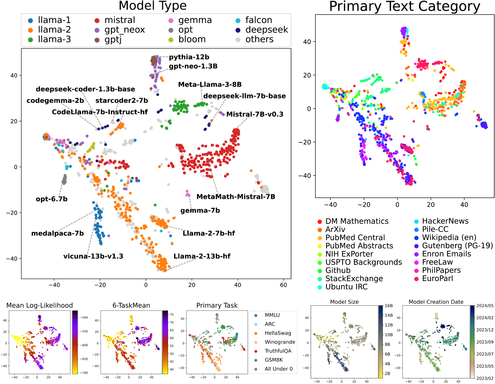

# Mapping 1,000+ Language Models via the Log-Likelihood Vector

## Paper

**Mapping 1,000+ Language Models via the Log-Likelihood Vector**  
Momose Oyama, Hiroaki Yamagiwa, Yusuke Takase, Hidetoshi Shimodaira  
[arXiv:2502.16173](https://arxiv.org/abs/2502.16173)

## Data

### Model

- [`models_1018.yaml`](models/models_1018.yaml)  
A list of 1,018 model names used in our research.

- [`model-data-1018.pkl`](data/model-metadata/model-data-1018.pkl)  
Collected metadata for the 1,018 models, including `model_type`, `model_size`, and other model attributes.  
Usage examples can be found in [load_model-data.ipynb](data/model-metadata/load_model-data.ipynb).

### Text

- [`texts-10k-pile.jsonl`](data/text/texts-10k-pile.jsonl)  
A JSONL file containing 10,000 text chunks from the Pile dataset. Each line in the file is a JSON object representing one chunk, with fields such as `text`, `pile_set_name`, and indexing metadata.

### Log-Likelihood

- [`raw_log-likelihood_1018.pkl`](data/log-likelihood/raw_log-likelihood_1018.pkl)  
Log-likelihood data for 1,018 language models calculated on the texts-10k-pile.jsonl dataset.  
Usage examples can be found in [load_log-likelihood.ipynb](data/log-likelihood/load_log-likelihood.ipynb).

- [`clipped_log-likelihood_1018.pkl`](data/log-likelihood/clipped_log-likelihood_1018.pkl)  
Log-likelihood data for 1,018 language models calculated on the texts-10k-pile.jsonl dataset.  
This data is derived by clipping the **bottom 2%** of the values from the `raw_log-likelihood_1018.pkl` data.  
Usage examples can be found in [load_log-likelihood.ipynb](data/log-likelihood/load_log-likelihood.ipynb).

## Code
- [`calculate-log-likelihood.ipynb`](codes/calculate-log-likelihood.ipynb)  
Jupyter notebook containing sample code for calculating log-likelihood.

## Examples

  

