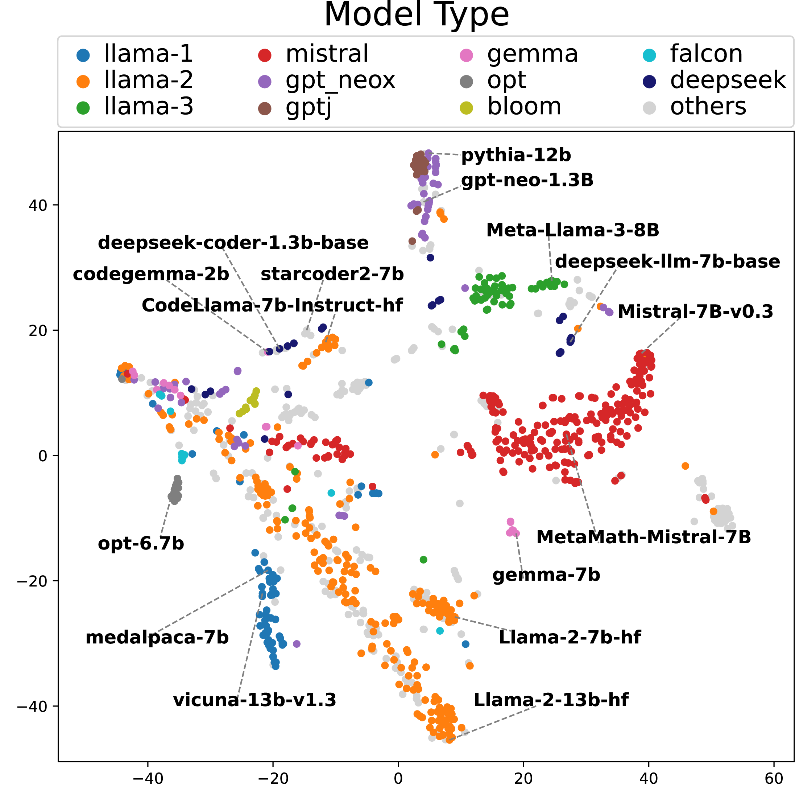

# ModelMap
*Embedding language models in probability space via log-likelihood vectors*

## Papers

* **[Classics: Early Papers on Model Maps](./classics/README.md)**

* **Mapping 1,000+ Language Models via the Log-Likelihood Vector**  
  Momose Oyama, Hiroaki Yamagiwa, Yusuke Takase, Hidetoshi Shimodaira  
  [arXiv:2502.16173](https://arxiv.org/abs/2502.16173) &#124; accepted to ACL 2025 main &#124; **[Data & Code](./1000models/README.md)** &#124;  **[Examples](./1000models/README.md#examples)**
