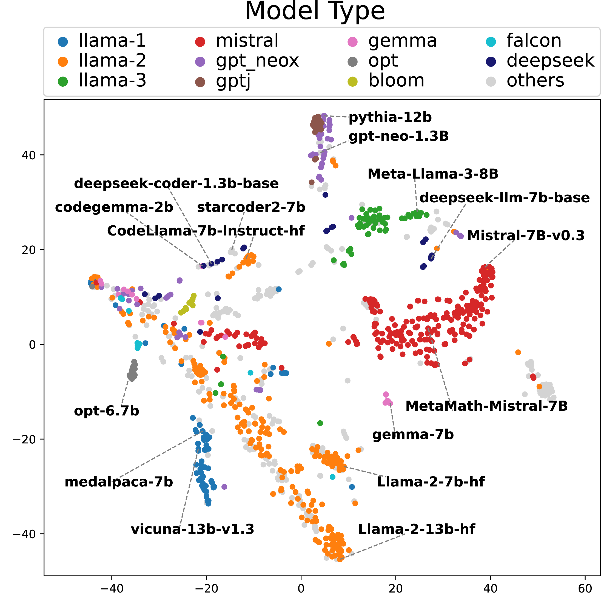

# ModelMap
*Embedding language models in probability space via log-likelihood vectors*

## Papers

* **[Classics: Early Papers on Model Maps](./classics/README.md)**

* **Mapping 1,000+ Language Models via the Log-Likelihood Vector**  
  Momose Oyama, Hiroaki Yamagiwa, Yusuke Takase, Hidetoshi Shimodaira  
  [arXiv:2502.16173](https://arxiv.org/abs/2502.16173) &#124; accepted to ACL 2025 main &#124; **[Data & Code](./1000models/README.md)** &#124;  **[Examples](./1000models/README.md#examples)**

* **Likelihood Variance as Text Importance for Resampling Texts to Map Language Models**  
Momose Oyama, Ryo Kishino, Hiroaki Yamagiwa, Hidetoshi Shimodaira  
[arXiv:2505.15428](https://arxiv.org/abs/2505.15428) &#124; accepted to EMNLP 2025 Findings &#124; **[Data & Code](./resampling-texts/README.md)**

* **Establishing a Scale for Kullback-Leibler Divergence in Language Models Across Various Settings**  
Ryo Kishino, Yusuke Takase, Momose Oyama, Hiroaki Yamagiwa, Hidetoshi Shimodaira  
[arXiv:2505.15353](https://arxiv.org/abs/2505.15353) &#124; accepted to ACL 2026 Findings &#124; **[Data & Code](./kl-scale/README.md)**