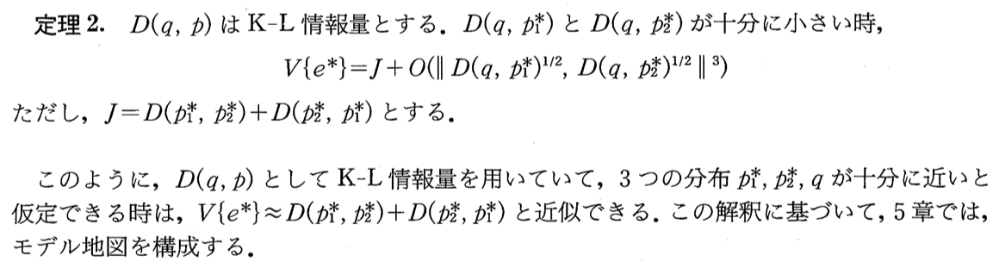
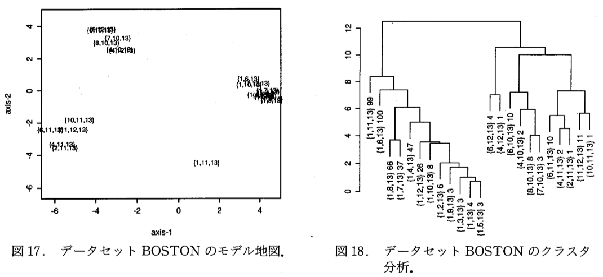
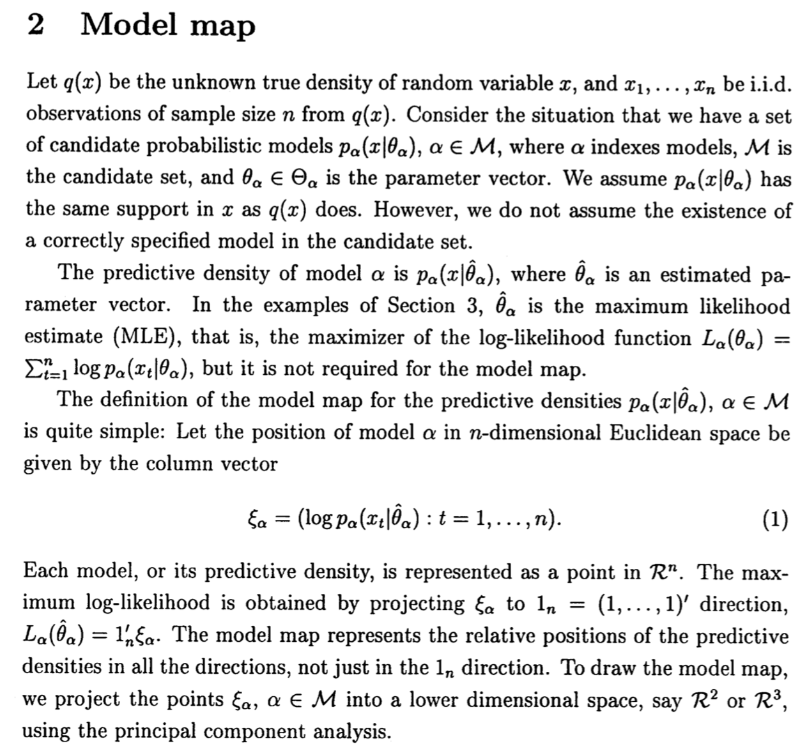
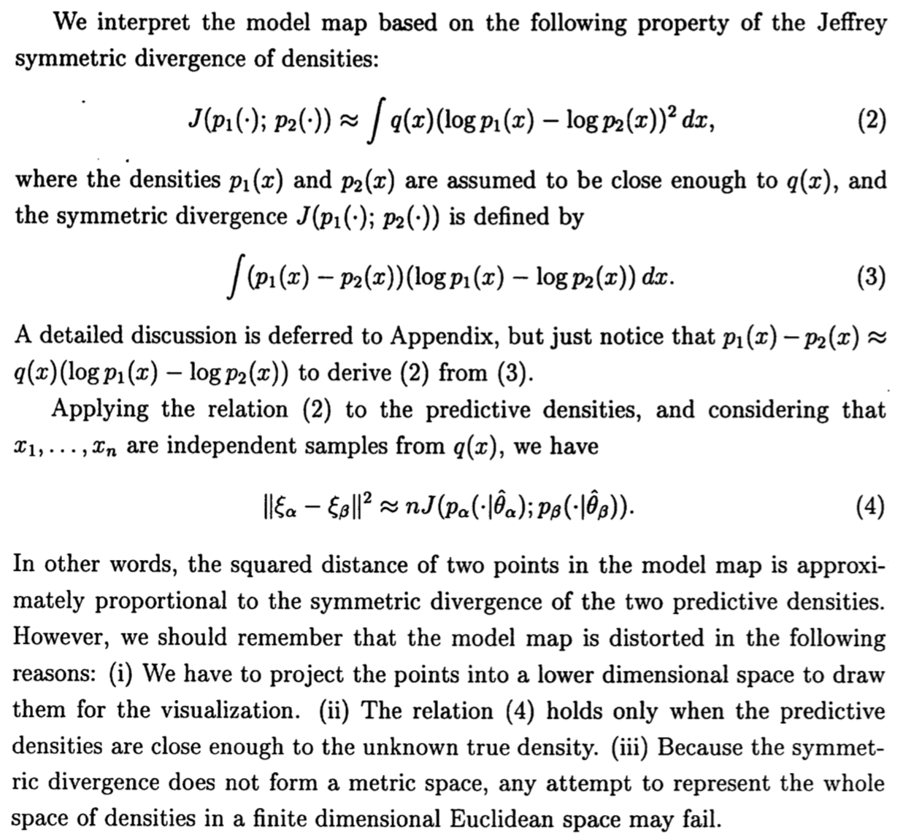
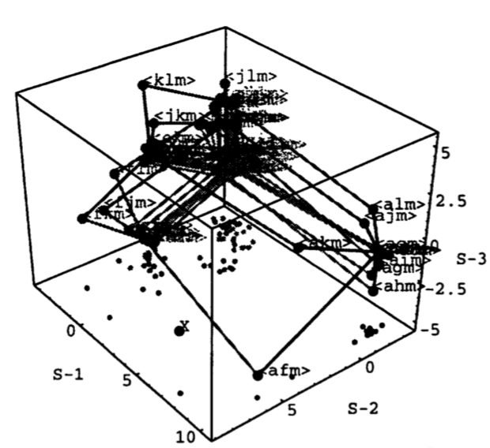
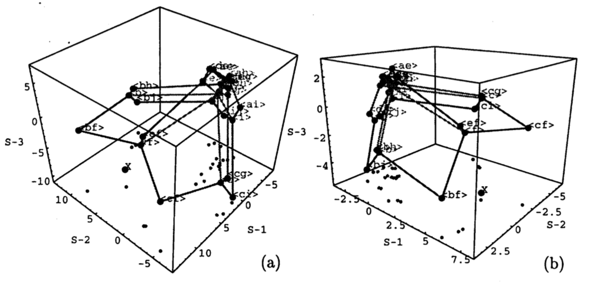
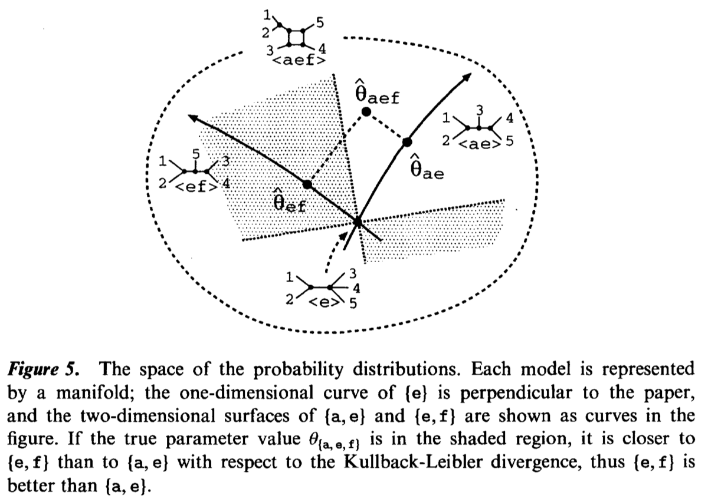
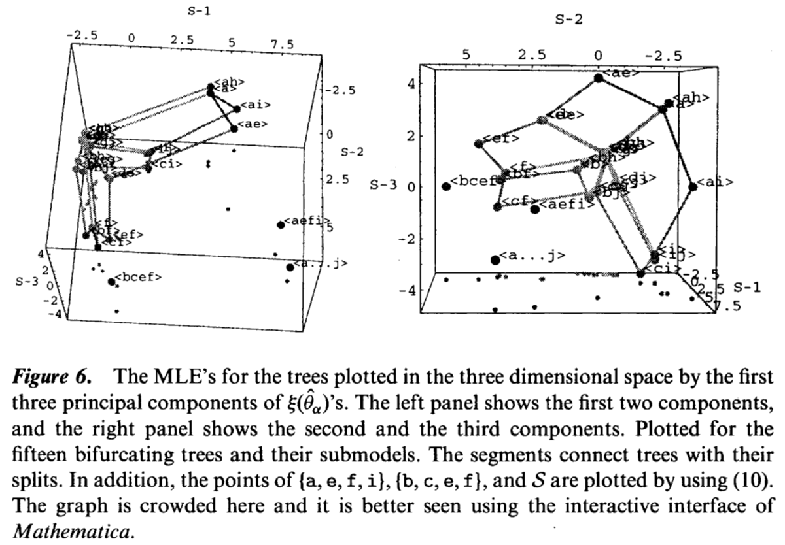
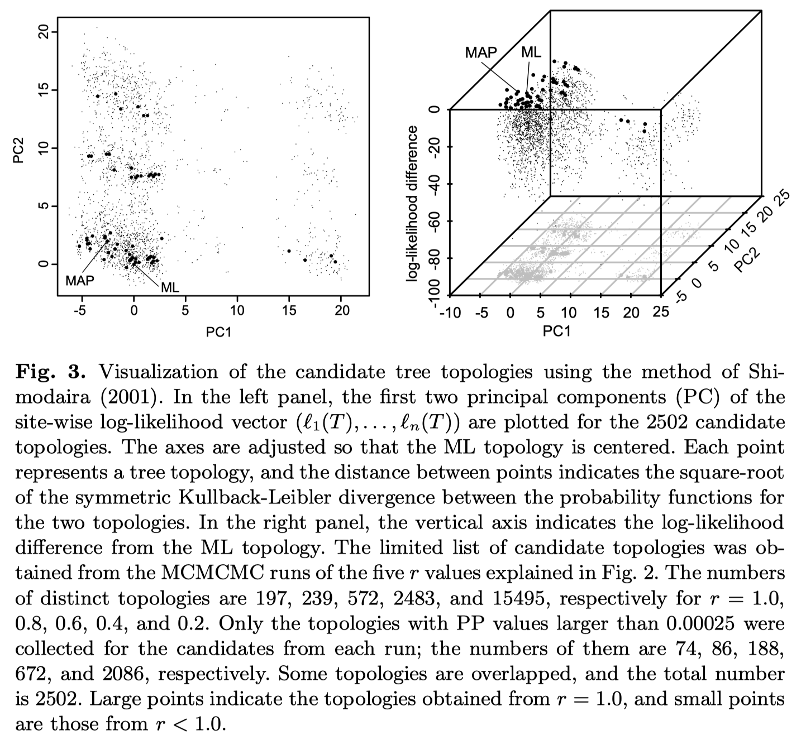
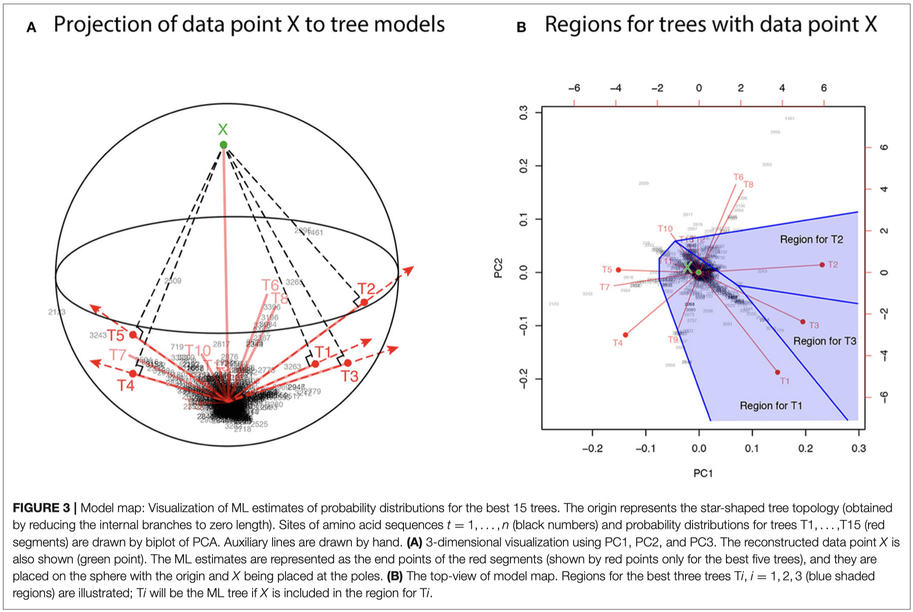

# Classics: Early Papers on Model Maps

- [Shimodaira (1993)](#shimodaira-1993)
- [Shimodaira and Cao (1998)](#shimodaira-and-cao-1998)
- [Shimodaira (2001)](#shimodaira-2001)
- [Shimodaira and Hasegawa (2005)](#shimodaira-and-hasegawa-2005)
- [Shimodaira and Terada (2019)](#shimodaira-and-terada-2019)

## Shimodaira (1993)

> Hidetoshi Shimodaira. *A Model Search Technique Based on Confidence Set and Map of Models (in Japanese)*. Proceedings of the Institute of Statistical Mathematics, Vol. 41, No. 2, 131-147, 1993. | [PDF](./1993-Shimodaira-Tokeisuri.pdf) | [Journal Site](https://www.ism.ac.jp/editsec/toukei/tokeisuri-41j.html)

This paper proposed two ideas: confidence sets of models and model maps. The concept of confidence sets was later widely adopted in the field of molecular phylogenetics, especially in what became known as the Shimodaira–Hasegawa (SH) test, particularly through [Shimodaira and Hasegawa (1999)](https://doi.org/10.1093/oxfordjournals.molbev.a026201). In contrast, the idea of model maps has received little attention or use.

Theorem 2 shows that the variance of the difference of log-likelihoods approximates the Jeffreys divergence between two models. Figures 17 and 18 show the model map of linear regression for the Boston housing data and the hierarchical clustering of the models.

- Theorem 2

- Figure 17 and 18

## Shimodaira and Cao (1998)

> Hidetoshi Shimodaira and Ying Cao. *A Graphical Technique for Model Selection Diagnosis*. Research Memorandum 680, Institute of Statistical Mathematics, Tokyo, Japan, 1998. | [PDF](./1998-Shimodaira-Cao-rm680.pdf) | [Research Memo Series Index (ISM)](https://www.ism.ac.jp/editsec/resmemo-e.html)

This work defines model maps based on log-likelihood vectors and presents examples from regression analysis and molecular phylogenetics. Part of this paper was later published as [Shimodaira (2001)](https://doi.org/10.1081/STA-100105696).

Section 2 describes the model map based on log-likelihood vectors. Figure 3 shows the model map of linear regression for the Boston housing data, and Figure 6 shows the model map of molecular phylogenetic tree topologies.

- Section 2

- Figure 3

- Figure 6

## Shimodaira (2001)

> Hidetoshi Shimodaira. *Multiple Comparisons of Log-Likelihoods and Combining Nonnested Models with Applications to Phylogenetic Tree Selection*. Communications in Statistics - Theory and Methods, Volume 30, Pages 1751–1772, 2001. | [DOI](https://doi.org/10.1081/STA-100105696)

The main focus of this paper is the theory of confidence sets of models, but a new concept related to model maps is also introduced. Given multiple models, the log-likelihood vector of a *full model* that encompasses all of them is estimated and added to the model map. Figure 5 illustrates the relationship between maximum likelihood estimates and models in the space of probability distributions. Figure 6 presents model maps illustrating relationships among different phylogenetic tree topologies of mammal species (human, harbor seal, cow, rabbit, mouse, and opossum).

- Figure 5

- Figure 6

## Shimodaira and Hasegawa (2005)

> Hidetoshi Shimodaira and Masami Hasegawa. *Assessing the uncertainty in phylogenetic inference*. Statistical Methods in Molecular Evolution (ed. Rasmus Nielsen), Statistics for Biology and Health, Springer, pages 463-492, 2005. | [Book DOI](https://doi.org/10.1007/0-387-27733-1)

This book chapter provides a comprehensive overview of the theory of confidence sets of models and its applications in phylogenetic tree estimation. It particularly compares Bayesian posterior probabilities obtained via Markov Chain Monte Carlo (MCMC) methods with confidence measures based on bootstrap resampling, such as the Shimodaira–Hasegawa test and the multiscale bootstrap method. Figure 3 shows model maps in which a large number of phylogenetic trees generated via MCMC are plotted.

- Figure 3

## Shimodaira and Terada (2019)

> Hidetoshi Shimodaira and Yoshikazu Terada. *Selective Inference for Testing Trees and Edges in Phylogenetics*. Frontiers in Ecology and Evolution, Volume 7, 174, 2019 | [DOI](https://doi.org/10.3389/fevo.2019.00174)

This paper proposes a method for calculating statistical confidence under selective inference (or post-selection inference) using the multiscale bootstrap resampling technique, and applies it to phylogenetic tree estimation. The concept of model maps is also discussed in this context. Figure 3 shows model maps of phylogenetic trees for mammals.

- Figure 3

