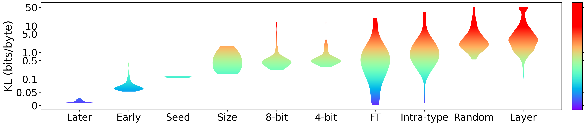
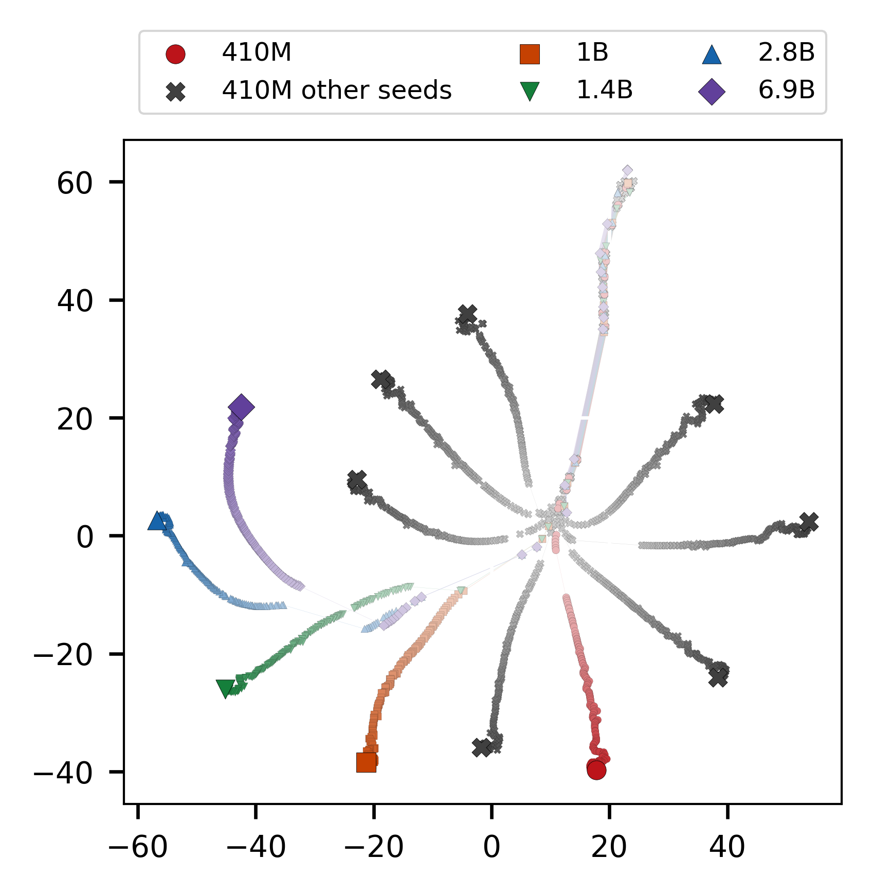
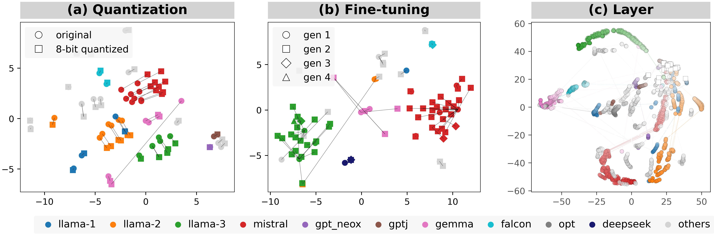
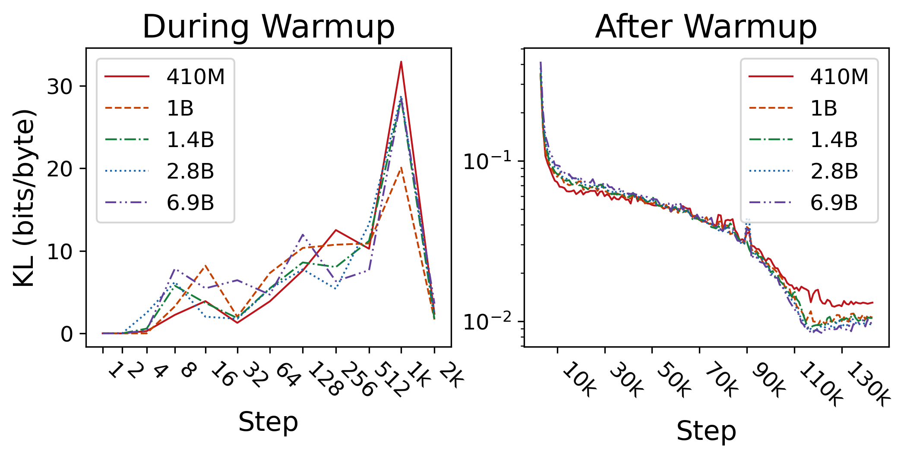
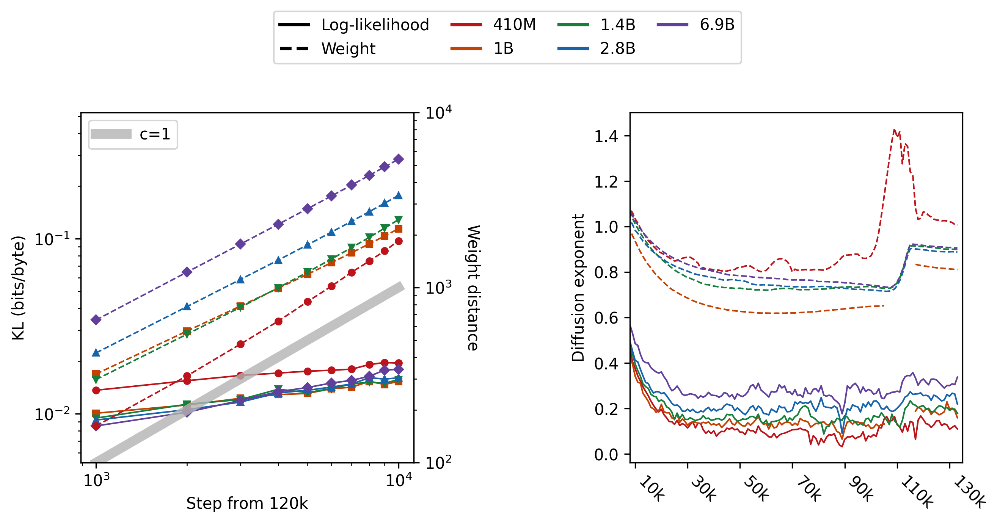

# Establishing a Scale for Kullback-Leibler Divergence in Language Models Across Various Settings



## Paper

**Establishing a Scale for Kullback-Leibler Divergence in Language Models Across Various Settings**  
Ryo Kishino, Yusuke Takase, Momose Oyama, Hiroaki Yamagiwa, Hidetoshi Shimodaira  
[arXiv:2505.15353](https://arxiv.org/abs/2505.15353) | accepted to ACL 2026 Findings

## Setup

The log-likelihood data under `data/logp/` is managed with Git LFS. Install
Git LFS before cloning this repository, or run `git lfs pull` after installing
it in an existing clone.

```bash
python3 -m venv .venv
source .venv/bin/activate
python -m pip install --upgrade pip
python -m pip install -r requirements.txt
```

## Data

The released files under `data/` contain the inputs needed to reproduce all
figures:

```text
data/
├── texts.json
├── logp/                  # log-likelihood vectors
├── model_info/            # model names, types, and parent links
├── tsne/                  # cached coordinates for Figures 1 and 2
└── weight_distance/       # cached Pythia weight distances
```

Treat `data/` as read-only. All generated files are written under `output/`;
the reproduction scripts do not need to load language models.
The log-likelihood arrays are stored as `float32` to keep the repository
compact; all KL calculations promote them to `float64` before arithmetic.

## Reproduce Figures

Run the following commands from this directory. Each script reads the released
files under `data/` and writes its output under `output/`.

### Figure 1: Pretraining Trajectories



```bash
python fig1.py --output-path output/fig1.png
```

Pythia pretraining trajectories across model sizes and random seeds, using the
released t-SNE coordinates.

### Figure 2: Quantization, Fine-tuning, and Layers



```bash
python fig2.py --output-path output/fig2.png
```

Model maps for 8-bit quantization, fine-tuning lineages, and intermediate
layers.

### Figure 3: KL Divergence Scale


```bash
python fig3.py --output-path output/fig3.png
```

KL-divergence distributions across the ten settings analyzed in the paper.

### Figure 4: KL During Pretraining



```bash
python fig4.py --output-path output/fig4.png
```

KL divergence between consecutive Pythia checkpoints during and after warmup.

### Figure 5: Diffusion Exponents



```bash
python fig5.py --output-path output/fig5.png
```

Squared distances and local diffusion exponents in log-likelihood and weight
spaces.

Figures 1 and 2 can also recompute t-SNE directly from the released
log-likelihood vectors:

```bash
python fig1.py --recompute-tsne --output-path output/fig1_recomputed.png
python fig2.py --recompute-tsne --output-path output/fig2_recomputed.png
```

Recomputed embeddings might differ from the cached coordinates across
scikit-learn versions because t-SNE is a numerical optimization procedure.

To save newly computed coordinates separately from the released cache:

```bash
python src/tsne.py --figure 1 --output-dir output/tsne
python src/tsne.py --figure 2 --output-dir output/tsne
```

## Optional Recalculation

Recalculating log-likelihoods or parameter distances is expensive and is not
required for figure reproduction. These scripts load Hugging Face models and
write to `output/` by default:

```bash
export HF_TOKEN=...
export HF_CACHE_DIR=/path/to/huggingface/cache

python src/calc_logp_pretraining.py
python src/calc_logp_quantization.py --quantize-bit 8
python src/calc_logp_quantization.py --quantize-bit 4
python src/calc_logp_layer.py
python src/calc_weight_distance.py --model-size 410m
```

`src/calc_logp_ft.py` retrieves fine-tuning parent metadata. The corresponding
log-likelihood vectors are already included in
`data/logp/oyama2025_logp.pkl`.

## Code Layout

- `fig1.py` to `fig5.py`: figure entry points
- `src/preprocess.py`: Pythia preprocessing and text-outlier removal
- `src/tsne.py`: t-SNE
- `src/calc_kl.py`: KL distributions across various settings
- `src/metrics.py`: shared KL divergence calculation
- `src/pythia.py`: shared Pythia model and checkpoint definitions

## Citation

```bibtex
@misc{kishino2026establishingscalekullbackleiblerdivergence,
  title={Establishing a Scale for Kullback-Leibler Divergence in Language Models Across Various Settings},
  author={Ryo Kishino and Yusuke Takase and Momose Oyama and Hiroaki Yamagiwa and Hidetoshi Shimodaira},
  year={2026},
  eprint={2505.15353},
  archivePrefix={arXiv},
  primaryClass={cs.CL},
  url={https://arxiv.org/abs/2505.15353}
}
```
