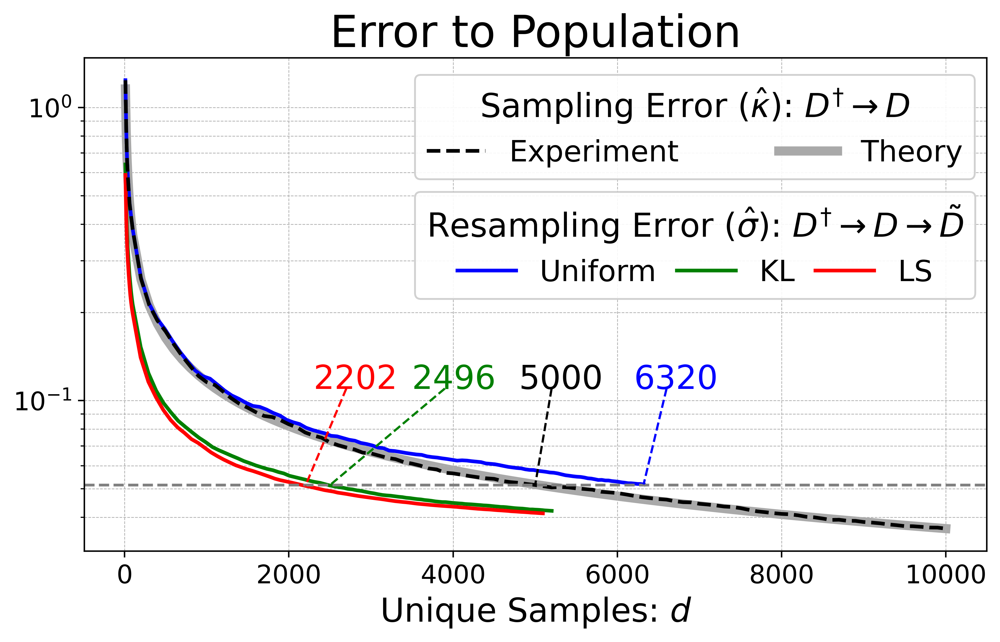
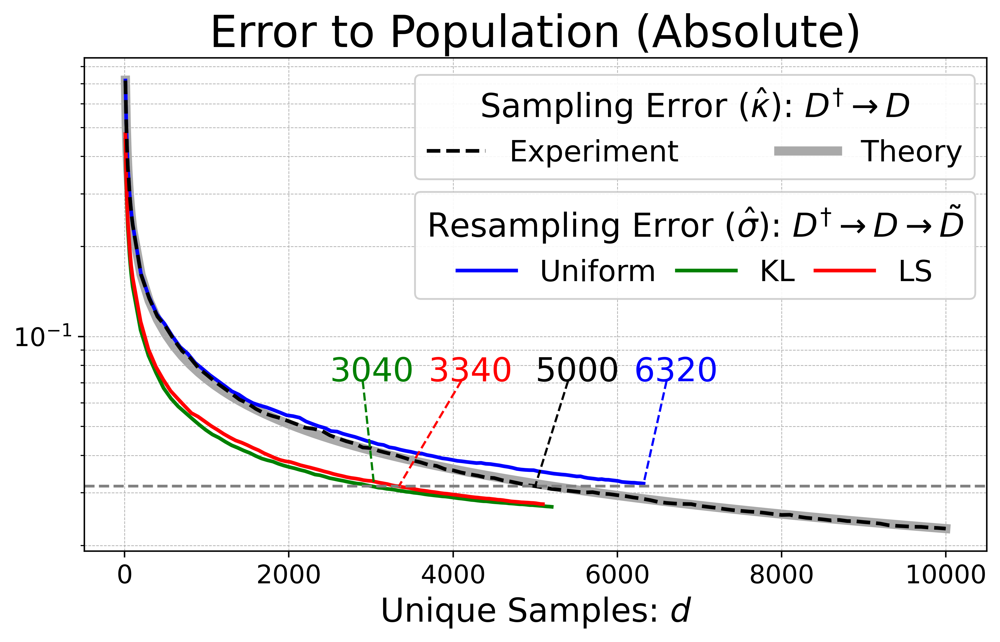
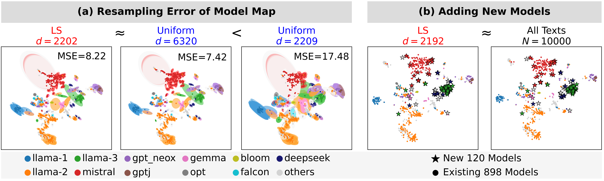

# Likelihood Variance as Text Importance for Resampling Texts to Map Language Models (EMNLP 2025 Findings)

## 📄 Paper
**Likelihood Variance as Text Importance for Resampling Texts to Map Language Models**  
Momose Oyama, Ryo Kishino, Hiroaki Yamagiwa, Hidetoshi Shimodaira  
[arXiv:2505.15428](https://arxiv.org/abs/2505.15428) &#124; accepted to EMNLP 2025 Findings

## 🔑 Key Results

### Performance of LS and KL Sampling (Figure2)
With approximately half the number of unique texts, both LS and KL sampling achieve model map errors comparable to those of uniform sampling.  

💨 Code (generate data): [`fig2_resampling_error.py`](./fig2_resampling_error.py)   
🥒 Data (plot-ready): [`data/fig2_resampling_error.pkl`](./data/fig2_resampling_error.pkl)  
📙 Notebook (visualize): [`figure2.ipynb`](./figure2.ipynb)  

<p align="center">
  
  
</p>


### Model Map with Resampled Texts (Figure3)
LS sampling is as robust as uniform sampling, but requires fewer texts.  
Using only texts selected through LS sampling allows new models to be efficiently added to the map.  

💨 Code (generate data): [`fig3a_mapvariance.py`](./fig3a_mapvariance.py) &#124; [`fig3b_addnew.py`](./fig3b_addnew.py)  
🥒 Data (plot-ready): [`data/fig3a_mapvariance.pkl`](./data/fig3a_mapvariance.pkl) &#124; [`data/fig3b_addnew.pkl`](./data/fig3b_addnew.pkl)  
📙 Notebook (visualize): [`figure3.ipynb`](./figure3.ipynb)  

<p align="center">

</p>


## 🦉 Misc.

- [`modeldata_1018.pkl`](./data/modeldata_1018.pkl) is shared with the one in [modelmap/1000models](../1000models/data/model-metadata).
- [`tsne_Q.pkl`](./data/tsne_Q.pkl) contains the t-SNE coordinates of the 1018 models. The procedure to compute them is described in [`tsne_Q.py`](./tsne_Q.py).
- The data in [`./data/uniq-idx-weight/`](./data/uniq-idx-weight/) summarizes the results of each resampling method. These can be reproduced by running [`uniq_idx_weight.py`](./uniq_idx_weight.py).
- The model map with sampling error is visualized in [`figure1.ipynb`](./figure1.ipynb).


## 📚 Citation

```BibTeX
@inproceedings{oyama-etal-2025-likelihood,
    author = {Momose Oyama and Ryo Kishino and Hiroaki Yamagiwa and Hidetoshi Shimodaira},
    title = {Likelihood Variance as Text Importance for Resampling Texts to Map Language Models},
    booktitle = {Findings of the Association for Computational Linguistics: EMNLP 2025},
    year = {2025}
}
```