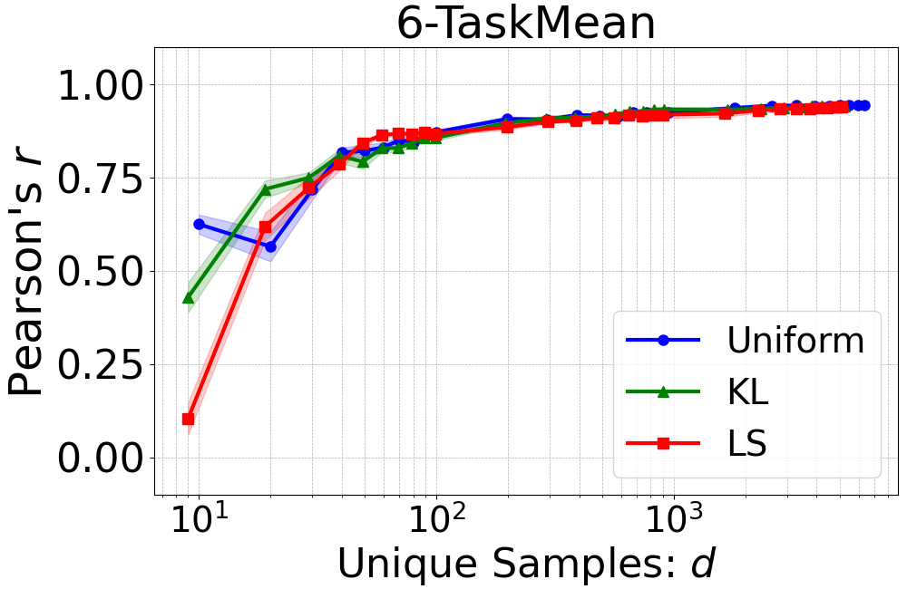
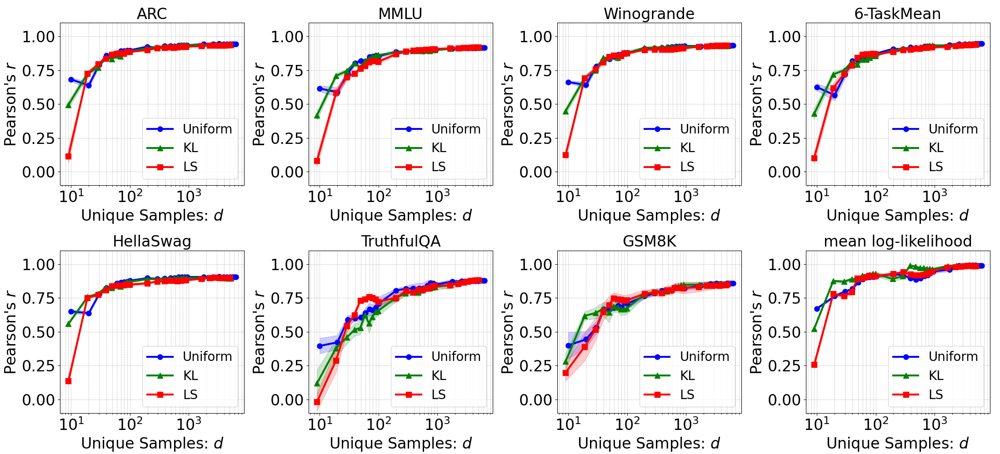

## Model Performance Prediction (Section 4.3 and Appendix F)

We use [`uv`](https://docs.astral.sh/uv/) for the experiment environment in this directory. See the official site for installation.

### Setup

With `uv` available, install the required packages:

```bash
$ uv sync
```

The experiments use [`../data/modeldata_1018.pkl`](../data/modeldata_1018.pkl) and [`../data/uniq-idx-weight/`](../data/uniq-idx-weight/). See [`../README.md`](../README.md) for details of these data.

### Data Preparation

Prepare training and prediction splits for ridge regression with `GroupKFold`:

```bash
$ uv run src/split_data.py
```

Five-fold splits with five seeds are saved to `output/split_data/groupkfold/`.

### Train and Predict with Ridge Regression

Train the ridge regression models and generate predictions (**This step takes about half a day !**) :

```bash
$ uv run src/train_and_pred.py
```

Predictions for each method (Uniform, KL, LS) are saved to `output/train_and_pred/groupkfold/`.

### Plot Figures

Draw Figure 4 from the predictions:

```bash
$ uv run src/figure4.py
```

Figure 4 is saved to `output/images/`.

<p align="center">

</p>

Draw Figure 6 from the predictions:

```bash
$ uv run src/figure6_and_table2.py
```

<p align="center">

</p>

Figure 6 is saved to `output/images/`. This script also saves the results for Table 2 to `output/summary/`.
